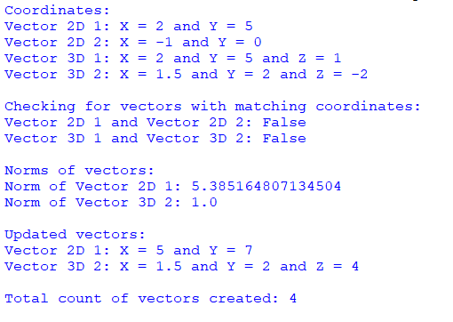

## Description
This Python program demonstrates how 2D and 3D vectors are organized and manipulated using 'class inheritance'. It allows you to create, compare, and update these vectors while performing operations like checking equality, calculating norms (lengths), and setting new values. The program also keeps track of the total count of created vectors.
## Output

